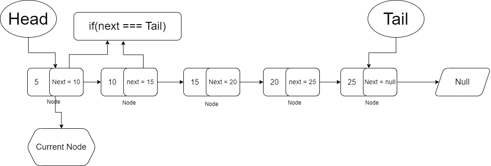

#   🅐 Singly Linked List:
    
    we have two part 
        1. node (data)
        2. next pointer
        
    1.Insert after a specific value
    2. Reverse order printing
    

**🎧 m-10-Linked-list:**

    01-structure-of-linked-list.cpp
    02-insert-in-head-linked-list.cpp
    03-traverse-linked-list.cpp
    04-searching-in-linked-list.cpp
    05-searching-all-possible-occurrence-linked-list.cpp

**🎧 m-12-Linked-list:**

    06-linkedList-length.cpp
    07-orderOf-1-length.cpp
    08-insert-at-any-index.cpp
    09-delete-at-head.cpp
    10-delete-at-any-node.cpp

**🎧 m-13-Linked-list:**
    
    11-insert-after-a-value.cpp
    12-reverse-print.cpp

**🎧 m-14-Doubly-Linked-list:**
    
    14-structure.cpp
    15-insertion-at-head.cpp
    16-insertion-at-any-index.cpp
    17-deletion.cpp
    18-reverse.cpp

###   Basic Operations(singly linked list):

    1. Insert after a specific value
    2. print reverse order recursively

#   🅑Doubly Linked List:
    
    1.Structure
    2.Insertion
    3.Deletion 
    4.Reverse 
    
    --> Here we can track our previous memory
        That means backtracking/backward movement is possible
                    --> Implementation easier

Real Example: *Browser navigation*

    we have three part 
        1. Previous node pointer 
        2. node (data)
        3. next pointer
        
**1.Structure of Doubly Linked list:**
   
         
        {[pre_pointer ][data][next_pointer_node]}
        
          memory address   memory address    memory address
     head↘️     ➍⓿                 ➎⓿             ➏⓿
          {[NULL][5][50]}-->{[➍⓿][10][➏⓿]}--> {[ ➎⓿][15][NULL]}
                       ↪️↪️↪️↪️↪️↪️⤴️
    index:      0                1                2
**2.Doubly linked list insertion:**   
   
         
        {[pre_pointer ][data][next_pointer_node]}
        
          memory address   memory address    memory address
     head↘️     ➍⓿                 ➎⓿             ➏⓿
          {[NULL][5][50]}-->{[➍⓿][10][➏⓿]}--> {[ ➎⓿][15][NULL]}
                       ↪️↪️↪️↪️↪️↪️⤴️
    index:      0                1                2

**3.Doubly linked list Deletion:**

#    Questions:

#####    🎧Note: All questions are about singly linked-lists here.

**1.Write the singly linked list class and a function to add a new element to the front of a singly linked list. Also write a function to print all the elements of the linked-list.**

`Sample Input:` [1, 2, 3, 4, 5], new element: 0

`Sample Output:` Singly linked list containing the elements [0, 1, 2, 3, 4, 5]

**2.Write a function to remove the first element of a singly linked list.**

`Sample Input:` [1, 2, 3, 4, 5]

`Sample Output:` Singly linked list containing the elements [2, 3, 4, 5]

**3. Write a function to remove the last element of a singly linked list.**
`Sample Input:` [1, 2, 3, 4, 5]

`Sample Output:` Singly linked list containing the elements [1, 2, 3, 4]

**4.Write a function to find the i-th index of a singly linked list.**

`Sample Input:` [1, 2, 3, 4, 5], i = 2

`Sample Output:` 3

**5.Write a function to add a new element to the back of a singly linked list.**

`Sample Input:` [1, 2, 3, 4, 5], new element: 0

`Sample Output:` Singly linked list containing the elements [1, 2, 3, 4, 5, 0]

**6.Write a function to check if a singly linked list contains a given element.**

`Sample Input:` [1, 2, 3, 4, 5], element: 3

`Sample Output:` True

**7.Write a function to sort a singly linked list in ascending order?**
`Sample Input:` [4, 2, 5, 1, 3]

`Sample Output:` Singly linked list containing the elements [1, 2, 3, 4, 5]

`Hint:` Look at the insertion sort code that we implemented in the array. Try to write the code in linked-list.

#####    🎧Note: All questions are about doubly linked-lists here.


**1.Write the doubly linked list class and a function to add a new element to the front of a doubly linked list. Also write a function to print all the elements of the linked-list.**

`Sample Input:` [1, 2, 3, 4, 5], new element: 0

`Sample Output:` Doubly linked list containing the elements [0, 1, 2, 3, 4, 5]

**2.Write a function to remove the last element of a Doubly linked list.**

`Sample Input:` [1, 2, 3, 4, 5]

`Sample Output:` Doubly linked list containing the elements [1, 2, 3, 4]

**3.Write a function to find the i-th index of a doubly linked list.**

`Sample Input:` [1, 2, 3, 4, 5], i = 2
`Sample Output:` 3

**Write a function to check if a doubly linked list contains a given element.**

`Sample Input:` [1, 2, 3, 4, 5], element: 3

`Sample Output:` True

**Write a function to reverse a doubly linked list?**

`Sample Input:` [1, 2, 3, 4, 5]

`Sample Output:` Doubly linked list containing the elements [5, 4, 3, 2, 1]

**Write a function to insert an element at a specific index in a doubly linked list.**

`Sample Input: `[1, 2, 3, 4, 5], index: 1, element: 0

`Sample Output:` Doubly linked list containing the elements [1, 0, 2, 3, 4, 5]

**How would you delete a specific element from a doubly linked list?**

`Sample Input:` [1, 2, 6, 4, 5], element: 6

`Sample Output:` Doubly linked list containing the elements [1, 2, 4, 5]

**Write a function to check if a doubly linked list is a palindrome.**

`Sample Input:` [1, 2, 3, 2, 1]
`Sample Output:` True


`Sample Input:` [1, 2, 3, 3, 1]
`Sample Output:` False

In the context of a doubly linked list, a palindrome is a list where the elements, when read from the first element to the last and then from the last element to the first, are the same.

 An example of a doubly linked list palindrome is [1, 2, 3, 2, 1], when read from the first element to the last it is [1, 2, 3, 2, 1] and when read from the last element to the first it is [1, 2, 3, 2, 1] as well. In this sense, a doubly linked list is a palindrome if the element at the first node is equal to the element at the last node, the element at the second node is equal to the element at the second to last node, and so on.


#   Explained Part

<h3>Welcome To Learn Linked List</h3>

Here is the all chapter that we will learn in this docs

<ul>
<li>লিস্টের প্রথম দিকে Node যুক্ত করা</li>
<li>লিস্টের শেষের দিকে Node যুক্ত করা</li>
<li>লিস্টের প্রথম দিক থেকে Node delete করা</li>
<li>লিস্টের শেষের দিক থেকে Node delete করা</li>
</ul>

</br>
<h2>What is Linked List?</h2>

<b>ডেটা স্টোর করার জন্য অ্যারের মত আরেকটি ডেটা স্ট্যাকচার হচ্ছে Linked List।</b> এটি স্ট্র্যাকচার অনুযায়ী ডাটা স্টোর করে, এবং রান টাইমে নতুন স্পেসের দরকার হলে অটোমেটিকেলি তা তৈরি করে নিতে পারে।  <b>এটি হচ্ছে ডাইনামিক ডেটা স্ট্রাকচার।</b>

- এটি অ্যারের মতই, তবে অ্যারেতে আমাদের কতটুকু মেমরি দরকার, প্রথমেই বলে দিতে হয়।
কিন্তু লিঙ্কড লিস্টে প্রয়োজন অনুযায়ী মেমরি বাড়ানো বা কমিয়ে নেওয়া যায়।

 আরো দুইটা সুবিধে হচ্ছে, 
- লিঙ্কড লিস্টের মাঝখান থেকে এর যে কোন আইটেম রিমুভ করা যায় বা মাঝখানে নতুন আইটেম যুক্ত করা যায়। 
- আর ইনিশালি কোন সাইজ ডিক্লেয়ার করে দিতে হয় না।

অসুবিধেও রয়েছে। 
- অ্যারে রেন্ডম এক্সেস করা যায়, কিন্তু লিঙ্কড লিস্টে রেডম এক্সেস করা যায় না।

<b>লিঙ্কড লিস্ট হচ্ছে ডাইন্যামিক্যালই এলোকেটেড নোড।</b> প্রত্যেকটা নোডের একটা `ভ্যালু` এবং একটা `পয়েন্টার `থাকে। 
পয়েন্টার এর পরবর্তি নোড বা লিঙ্কড লিস্টের পরবর্তি মেম্বারকে পয়েন্ট করে। 

এটা ট্রেনের মত। প্রথম মেম্বার হচ্ছে ট্রেনের ইঞ্জিন। এবং এরপরবর্তী বগিটি ইঞ্জিনের সাথে কানেকটেড থাকে, যা পয়েন্টার। পরের বগিটি এর পরের বগিটির সাথে কানেকটেড থাকে। যদি শেষে কোন বগি না থাকে, তখন আমরা বলি ট্রেনের শেষ। একই ভাবে লিঙ্কড লিস্টের পয়েন্টার যদি শূন্য হয়, তাহলে আমরা বলি এর পর আর কোন মেম্বার নেই। লিঙ্কড লিস্টে প্রথম নোড অনেক গুরুত্বপূর্ন, কারণ এটাতে পরবর্তী মেম্বারের পয়েন্টার থাকে। যদি প্রথম মেম্বার কোন ক্রমে রিমুভ হয়ে যায়, তাহলে পুরো লিঙ্কড লিস্টিই আর খুঁজে পাওয়া যাবে না। ট্রেনের ইঞ্জিন ছাড়া অন্য বগি গুলো যেমন কোন কাজে আসে না।

নিচের ছবিটি লক্ষ করুন,


</br>
এটি হচ্ছে লিঙ্কড লিস্টের একটি নোড। নোডের দুইটা অংশ, একটা হচ্ছে ডেটা। আরেকটা হচ্ছে এড্রেস। এমন অনেক গুলো নোড নিয়েই লিঙ্কড লিস্ট তৈরি।  প্রথম নোডের Address দ্বিতীয় নোডের এড্রেস পয়েন্ট করা থাকে। নিচের ছবিটির মতঃ

</br>


</br>
এভাবে যত ইচ্ছে তত গুলো নোড যুক্ত করা যায়।

ট্রেনের এক একটা আলাদা ব্লককে আমরা বলি বগি, লিঙ্কড লিস্টে আমরা বলব নোড।

<h4>Linked List দুই ধরণের। নিচে দেওয়া হলঃ</h4>

<ul>
    <li>Singly Linked List</li>
    <li>Doubly Linked List</li>
</ul>

</br>

<h2>Singly Linked List</h2>

**Singly Linked List** এ আমরা head এবং tail নামক ২টি জিনিস পাই, যেটা দিয়ে আমরা বুঝতে পারবো যে আমাদের কোন এলিমেন্ট head এবং কোন এলিমেন্ট tail আর head এর মানে হচ্ছে সবার প্রথম সংখ্যা এবং tail এর মানে হচ্ছে সবার শেষের সংখ্যা। এরপর Singly Linked List এ আমরা next নামে ও একটি জিনিস পাই যেটা দ্বারা আমরা জানতে পারি যে আমাদের current এলিমেন্টের পরে কোন এলিমেন্ট রয়েছে। 
আচ্ছা বুঝতে না পারলে সমস্যা নয়, নিচের ছবিটি দেখেন এবং ওই ছবি থেকে আমরা আরো বিস্তারিত আলোচনা করবো নিচে।

</br>


</br>
উপরের ছবিটি লক্ষ করলে দেখবেন যে একদম প্রথমে head রয়েছে এবং একদম শেষে tail রয়েছে এবং মাঝখানে length রয়েছে। এবং নিচের যে arrow চিহ্ন দিয়ে next next দেখানো হয়েছে ওটা হচ্ছে এড্রেস এবং সেখানে আমরা দেখতে পারবো যে আমাদের এই এলিমেন্টের পরে next কোন এলিমেন্ট রয়েছে। আর এভাবে আমাদের Singly Linked List চলতে থাকবে এবং সবার শেষে মানে tail এ যে থাকবে তার কোনো next value থাকবে না মানে ওই এলিমেন্টের next value null থাকবে।

</br>
<h2>Singly Linked List - delete last node using <b>POP</b> method</h2>

</br>


</br>

উপরের ছবিটিতে দেখা যাচ্ছে যে একটি head এবং একটি tail রয়েছে ( আগে যেভাবে বলেছিলাম ) তারপর আমাদের node গুলো রয়েছে এবং বলেছিলাম যে প্রত্যেকটি node এর সাথে next নামে একটা প্রপার্টি থাকে যার মাধ্যমে আমরা জানতে পারি যে আমাদের এই node এর পরবর্তী node কোনটি অথবা তার value কত? তাহলে এইবার আমরা চাচ্ছি যে আমাদের এই singly linked list থেকে সবার শেষে যে এলিমেন্টটি থাকবে থাকে ডিলিট করবো, তাহলে আপনারা বলতে পারেন যে আমরা তো সেটি পেয়ে যাচ্ছি যদি আমরা tail কে ধরি তাহলেই। না, Linked List এ এইভাবে করা যায় না। কারণ Linked List এ আমরা একটি এলিমেন্ট থেকে পরের এলিমেন্টে যেতে হলে পয়েন্টার ব্যবহার করে যেতে হয় যেটা আমরা Linked List এর সব Node এর মধ্যে পেয়ে থাকি ( next যেটা ওইটাই )। তাহলে আমরা যদি POP মেথডের সাহায্যে কোনো node ডিলিট করতে চাই তাহলে, উপরের Diagram এ দেয়া আছে সেভাবে ফলো করবো। প্রথমে আমাদের প্রথম যে node আছে সেটাকে currentNode নামে একটি variable এ রাখবো এবং আমরা চেক করবো যে আমাদের এই currentNode এর ভিতরে next নামে যে প্রপার্টি রয়েছে সেটা কি আমাদের পুরো Linked List এর যে Tail রয়েছে সেটার সমান? যদি সমান হয় তাহলে তো আমরা লাস্ট node টি পেয়ে গেলাম আর যদি সমান না হয় তাহলে আমরা ওই currentNode এর nextNode যেটা আছে ওইটাকে currentNode বানিয়ে দিবো এবং আবার সেইম প্রসেসে চেক করবো যে এই currentNode এর nextNode কি আমাদের tail এর সমান? এভাবে চেক করে করে আমরা পুরো node দেখবো এবং যেখানে গিয়ে আমরা tail এর সমান পাবো ( অর্থাৎ, if(next === tail) সত্যি হলে ) আমরা ওই node টাকে delete করে দিবো এবং আমাদের tail কে নিয়ে আসবো আমরা যে currentNode পেয়েছি ওইটায়, মানে এখন tail হচ্ছে ওই currentNode। এবং সর্বশেষ যখন আমাদের list এ কোনো node থাকবে না তখন আমরা আমাদের head এবং tail করে দিবো null কে ( মানে শুরুতে যেভাবে ছিলো সেভাবে )।

> যদি code দেখে বুঝতে চান তাহলে এই রিপোজিটরিতে <b>Singly List List</b> ফোল্ডারের মধ্যে পাবেন সব কোড।

</br>
<h2>Singly Linked List - delete first node using <b>SHIFT</b> method</h2>
> এবার আমরা চাচ্ছি যে আমাদের লিস্টের মধ্যে থাকা সব node থেকে সবার প্রথমে যেটা থাকবে সেটাকে delete করে দিবো যখন Shift() মেথডটি call করবো তখন। এবং এই কাজটি অনেক সহজ। আমরা প্রথমে চেক করে নিবো যে আমাদের লিস্টটি কি একেবারে খালি নাকি যদি খালি থাকে তাহলে আমরা null রিটার্ন করবো নাহলে আমাদের delete এর করবো। তো delete করার জন্য আমাদের প্রথমে একটি variable নিতে আমাদের যে head রয়েছে সেটাকে currentNode নামক একটি variable এ রাখবো। তারপর আমরা আমাদের লিস্টের যে tail রয়েছে তার সমান currentNode এর next বসিয়ে দিবো ( this.tail = currentNode.next এভাবে )। তাহলেই তো আমাদের delete করা সম্পূর্ণ। এরপর আমরা আমাদের লিস্টের length কমিয়ে দিবো, কারণ একটি node delete হয়ে গেলে তো আমাদের একটি length কমাতে হবে তাই। এরপর আমরা আরেকটা চেক করবো যে যদি আমাদের length === 0 হয় তাহলে tail যেন null হয়ে যায়। কারণ head null হয়ে যাবে shift() call করার মাধ্যমে কিন্তু দেখা যাবে যে আমাদের tail এ value রয়ে গেছে তার কারণে আমরা এটা করবো যে যখন length 0 হয়ে যাবে তখন tail এর value null হয়ে যাবে এবং tail এর next ও null হয়ে যাবে। এককথায় সব কিছু null থাকবে যদি length 0 হয়ে যায়।

> reference এর জন্য নিচে কোড দিয়ে দিলাম কিভাবে shift method implement করা যায়।

```js
// shift method
shift() {
    // চেক করা হচ্ছে যে আমাদের লিস্ট খালি কি না।
    if (!this.isEmpty()) {
      // currentNode নামক একটি variable এ আমাদের লিস্টের head কে রাখা হচ্ছে।
      let currentNode = this.head;

      // এবার delete করা হচ্ছে জাস্ট আমাদের লিস্টের head কে currentNode এর next বানিয়ে দেওয়া হচ্ছে।
      this.head = currentNode.next;

      // এবার লিস্টের length কমানো হচ্ছে।
      this.length--;

      // চেক করা হচ্ছে যে যদি লিস্টের length 0 হয় তাহলে tail যেনো null হয়ে যায়।
      if (this.length === 0) {
        this.tail = null;
      }

      // সবার শেষে currentNode return করা হচ্ছে।
      return currentNode;
    }
  }
```

</br>
<h2>Singly Linked List - Add the node in the first position of the list using the <b>UNSHIFT</b> method</h2>
> প্রথমে তো আমরা আমাদের লিস্টে node যুক্ত করেছিলাম লাস্টের দিক দিয়ে যেভাবে কোনো array তে push() method ব্যবহার করে করতাম। কিন্তু এখন আমরা চাচ্ছি যে যখন কোনো node যুক্ত করবো তখন সেই node যেনো আমাদের লিস্টের প্রথম দিকে যুক্ত হয় মানে array এর unshift() method যেভাবে কাজ করে ওইভাবেই। এটা করার জন্য বেশি কোনো কাজ করতে হবে না। আমরা যখন কোনো node যুক্ত করবো তখন ওই node কে আমাদের লিস্টের head বানিয়ে দিবো এবং নতুন যে node তৈরি করেছি সেই node এর next বানিয়ে দিবো আমাদের আগের head যেটা ছিলো ওইটাকে তাহলেই আমাদের node যুক্ত করা হয়ে যাবে।

> বিষয়টি হয়তো ক্লিয়ার হন নি। তাই নিচে কোড দেওয়া হলো এবং কমেন্টের মাধ্যমে বুঝানো হলো কোন লাইন কি কাজে ব্যবহার হচ্ছে।

```js
// unshift method
unshift(value) {
    // এখানে নতুন node তৈরি করা হচ্ছে। যখন unshift method call করা হবে তখন আপনি একটি value দিবেন আর ওই value দিয়েই এই নতুন node তৈরি করা হচ্ছে।
    let newNode = {
      head: value,
      next: null,
    };

    // চেক করা হচ্ছে আমাদের লিস্ট কি empty। যদি empty হয় তাহলে if এর কাজ করবে না হলে else এর কাজ করবে।
    if (this.isEmpty()) {
      // এখন আমাদের লিস্টের head যেটা রয়েছে সেটার value হিসেবে আমাদের নতুন node কে দেয়া হলো
      this.head = newNode;

      // এখন আমাদের লিস্টের tail যেটা রয়েছে সেটার value হিসেবে আমাদের নতুন node কে দেয়া হলো
      this.tail = newNode;
    } else {
      // আমাদের নতুন node যখন তৈরি করেছিলাম তখন নতুন node এর next কে null রেখেছিলাম তাই এখন ওই নতুন node এর next এর value হিসেবে আমাদের আগের head কে দিয়ে দিচ্ছি।
      newNode.next = this.head;

      // এখানে আমাদের লিস্টের head এর জায়গায় আমাদের নতুন node কে বসিয়ে দিচ্ছি।
      this.head = newNode;

      // এবার একটি node যুক্ত হলে তো আমাদের লিস্টের length ও বৃদ্ধি করতে হবে সেটাই এখানে করা হচ্ছে।
      this.length++;
    }
  }

```

</br>
<h1>Doubly Linked List</h1>


</br>
> উপরের ছবিটি লক্ষ করুন, Doubly linked list এর সবকিছু সেইম singly linked list এর মতো, শুধু পরিবর্তনটি হচ্ছে singly linked list এ আমরা previous নামে কোনো জিনিস পেতাম না কিন্তু Doubly linked list এ আমরা previous নামে একটা property পাচ্ছি যেটার মাধ্যমে আমাদের currentNode এর আগের node কোনটি সেটা জানতে পারবো। তাছাড়া বাকি সব singly linked list এর মতো।

<h2>Doubly Linked List - Add the node in the last position of the list using the <b>PUSH</b> method</h2>
> Singly Linked List এ আমরা যেভাবে push method ইমপ্লেমেন্ট করে লিস্টের শেষের দিকে node যুক্ত করেছিলাম ঠিক সেইভাবেই Doubly Linked List এ করতে পারবো, শুধু একটি জিনিস বাড়বে আরা সেটা হচ্ছে previous point. উপরে বলা হয়েছে যে Doubly Linked List এ মোট তিনটি প্রপার্টি পাবো (value, next, prev)। সেইম ভাবে আমাদের head এবং tail থাকবে লিস্টে এবং length থাকবে। প্রথমে আমরা চেক করে নিবো যে আমাদের লিস্টে কোনো node আছে কি না, যদি না থাকে তাহলে তো আমরা যে node যুক্ত করবো সেটা হবে head এবং সেটাই হবে tail আর প্রথম node এর next value থাকবে null এবং prev value থাকবে null। তারপর যদি আমাদের লিস্টে আগে থেকে একটি node যুক্ত করা থাকে তাহলে আমরা যখন আরেকটি নতুন node যুক্ত করবো তখন তো ওই node এর next এবং prev value অবশ্যই থাকবে। আর সেটা আমরা এভাবে করবো যে আমাদের বর্তমান যে tail রয়েছে সেটার next এর value সমান করে দিবো আমাদের নতুন যে node যুক্ত হতে চাচ্ছে সেটাকে এবং আমাদের নতুন node এর prev value সেট করে দিবো আমাদের যে tail রয়েছে সেটাকে এবং অবশেষে আমাদের tail এর value সেট করে দিবো আমাদের নতুন যে node যুক্ত হতে চাচ্ছে সেটাকে, ব্যাস আমাদের কাজ হয়ে গেছে সবার শেষে আমরা আমাদের লিস্টের length বাড়িয়ে দিবো।

</br>

> নিচের কোডের মাধ্যমে আরো ভালোভাবে Doubly Linked List এ Push method ইমপ্লিমেন্ট করা হলো।

```js
// push method implement

// একটা টেম্পলেট তৈরি করে নিলাম যাতে আলাদা করে আবার সব প্রপার্টি গুলো লিখতে না হয়।
class NodeTemplete {
  constructor(value) {
    this.value = value;
    this.next = null;
    this.prev = null;
  }
}

// এটা হচ্ছে আমাদের মেইন Doubly Linked List ক্লাস।
class DoublyLinkedList {
  constructor() {
    this.head = null;
    this.tail = null;
    this.length = 0;
  }

  // চেক করে নিচ্ছি যে আমাদের লিস্ট কি empty নাকি। এটা আমাদের true or false রিটার্ন করবে।
  isEmpty() {
    return this.length === 0;
  }

  // এইটা হচ্ছে আমাদের push method
  push(value) {
    // এখানে আমরা যে value পাচ্ছি তা দিয়ে নতুন একটি node তৈরি করে নিচ্ছি। আমরা আগে যে টেম্পলেট তৈরি করেছিলাম সেটা এখানে call করলাম এবং আমাদের value টি দিয়ে দিলাম।
    let newNode = new NodeTemplete(value);

    // আবার চেক করা হচ্ছে, যদি আমাদের head না থাকে তাহলে if এর কাজ করবে ( head null থাকলে আরকি ) আর যদি head এ কোনো node থেকে থাকে তাহলে else এর কাজ করবে।
    if (!this.head) {
      // এখানে আমাদের head করে দিলাম নতুন যে node সেটা।
      this.head = newNode;

      // এখানে আমাদের tail করে দিলাম নতুন যে node সেটা।
      this.tail = newNode;
    } else {
      // এখানে আমাদের যে tail রয়েছে সেটার next প্রপার্টির value করে দিলাম আমাদের নতুন node কে।
      this.tail.next = newNode;

      // এখানে আমাদের যে নতুন node রয়েছে সেটার previous value সেট করে দিলাম আমাদের আগের যে tail ছিলো সেটাকে।
      newNode.prev = this.tail;

      // তারপর যেহেতু আমরা নতুন একটি node শেষের দিকে যুক্ত করলাম, তাই আমাদের লিস্টের tail করে দিলাম আমাদের নতুন node কে।
      this.tail = newNode;
    }

    // এখন একটি node যুক্ত করলে তো আমাদের লিস্টের length ও বাড়াতে হবে সেটা এখানে করলাম।
    this.length++;
  }
}

let test = new DoublyLinkedList();
test.push(5);
test.push(10);

console.log(test);
```

</br>
<h2>Doubly Linked List - Delete the node in the last position of the list using the <b>POP</b> method</h2>

**Doubly Linked List** এ লাস্টের দিক থেকে কোনো node ডিলিট করা সেইম Singly Linked List এর মতোই শুধু পার্থক্য হচ্ছে Doubly Linked List এ prev যে আরেকটি value থাকে সেটা। 

ওকে, আমরা Singly Linked List এ লাস্টের দিকের node ডিলিট করার জন্য চেক করতাম যে আমাদের currentNode ( currentNode নামে একটি variable নিতাম এবং এর value সেট করে দিতাম head কে ) কি আমাদের tail এর সমান, যদি সমান হয় তাহলে আমরা currentNode টিকে আমাদের tail বানিয়ে দিতাম এবং currentNode এর next করে দিতাম null। কিন্তু Doubly Linked List এ এর কিছুটা ব্যতিক্রম। 

আমরা Doubly Linked List এভাবে করবো... প্রথমে চেক করে নিবো আমাদের যদি কোনো node না থাকে তাহলে আমরা জাস্ট null রিটার্ন করে দিবো। আর যদি আমাদের শুধুমাত্র একটি node থেকে থাকে তাহলে আমরা আমাদের লিস্টের head এবং tail কে null করে দিবো ( মানে ওই node টি ডিলিট হয়ে গেছে )।

 এবার আসি মুল ডিলিটেশনে, আমাদের লিস্টের tail যেটা আছে সেটা প্রথমে আমরা একটি variable এ রাখবো। তারপর আমাদের লিস্টের tail করে দিবো যে বর্তমানে tail আছে তার prev কে ( মানে বর্তমান tail এর previous value যেটা আছে ওইটাকে )। এবার আমরা তো সব লাস্টের node টি ডিলিট করতে চাচ্ছি এবং আমরা জানি যে আমাদের যে tail রয়েছে তার next value হচ্ছে null তাই আমরা যেহেতু এখন নতুন tail তৈরি করে নিয়েছি তাই ওই tail এর next value করে দিবো null। কিন্তু এখনো একটি কাজ বাকি আছে... আমাদের আগের যে tail ছিলো ( মানে ডিলিট করার আগে ) সেটার কিন্তু একটি prev node ছিলো কিন্তু আমরা তো এখন ওই tail ডিলিট করে দিয়েছি তাই আমাদের ওই tail এর prev কে ও null করে দিতে হবে। ব্যাস আমাদের কাজ হয়ে গেছে। এবার জাস্ট লিস্টের length কমিয়ে দিলেই হয়ে যায়।

</br>


```js
// pop method implement
pop() {
    // চেক করে নিচ্ছি লিস্ট কি পুরো খালি।
    if (!this.head) {
      return null;
    }

    // নতুন একটি variable এ আমাদের tail কে রাখলাম।
    let popNode = this.tail;

    // এবার চেক করে নিচ্ছি যদি আমাদের লিস্টে একটি node থাকে তাহলে আমরা if এর কাজ করবো নাহলে else এর কাজ।
    if (this.head === 1) {
      // head কে null করে দিচ্ছি।
      this.head = null;

      // tail কে null করে দিচ্ছি।
      this.tail = null;
    } else {

      // বর্তমানে আমাদের লিস্টের যে tail হবে সে হচ্ছে আমাদের লিস্টের আগে যে tail ছিলো তার previous এ থাকা node।
      this.tail = popNode.prev;

      // এবং আমাদের লিস্টের আগের tail এর next এর value করে দিচ্ছি null।
      popNode.next = null;

      // এবং আমাদের লিস্টের আগের tail এ থাকা prev কে ও null করে দিচ্ছি।
      popNode.prev = null;
    }

    // লিস্টের length কমাচ্ছি।
    this.length--;

    // সবার শেষে আমাদের নতুন যে tail তৈরি করলাম সেটা রিটার্ন করে দিচ্ছি।
    return popNode;
  }

```

</br>
<h2>Doubly Linked List - Add the node in the first position of the list using the <b>UNSHIFT</b> method</h2>

**সংক্ষেপে বুঝার চেষ্টা করি** আমরা, যেহেতু আমাদের Doubly linked list এ previous node রয়েছে তাই এটি Singly linke list থেকে ভিন্ন এবং এটিতে Push, Pop, Unshift, Shift এগুলো ইমপ্লিমেন্ট করাও একটু ভিন্ন Singly linked list থেকে। 
ওকে কাজের কথায় আসি, আমরা এখন Unshift এর মাধ্যমে লিস্টের প্রথম দিকে node যুক্ত করতে চাচ্ছি তাই আমাদের এটি ইমপ্লিমেন্ট করতে হবে। আমরা এটা করবো যে... প্রথমে তো চেক করে নিবো যে আমাদের লিস্টে কোনো node আছে কি না এবং আমাদের নতুন node কে একটি variable এ স্টোর করে রাখবো। তারপর আমাদের লিস্টের যে head রয়েছে তার যে prev node রয়েছে তাকে আমাদের নতুন node করে দিবো ( শুরুতে prev কিন্তু ছিলো null )। এরপর আমাদের নতুন node এর next node করে দিবো আমাদের যে head রয়েছে থাকে এবং আমরা যখন নতুন node লিস্টের প্রথমে যুক্ত করতে চাচ্ছি সেহেতু আমরা যে node যুক্ত করবো সেটিই তো আমাদের head হবে তাই না ? এজন্যই এবার আমরা আমাদের লিস্টের head করে দিবো আমাদের যে নতুন node তাকে ব্যাস আমাদের node যুক্ত করা হয়ে গেছে।

</br>

> বুঝেননি! কোনো ব্যাপার না নিচে কোড দেওয়া হলো এবং সাথে তো অবশ্যই কমেন্ট করা আছে।

```js
// unshift method implement

// এটা একটি টেম্পলেট নতুন node এর জন্য।
class NodeTemplete {
  constructor(value) {
    this.value = value;
    this.next = null;
    this.prev = null;
  }
}

unshift(value) {

    // এখানে আমাদের নতুন node একটি variable এর মধ্যে রাখছি এবং উপরে যে টেম্পলেট তৈরি করেছিলাম সেটা call করে দিয়েছি।
    let newNode = new NodeTemplete(value);

    // চেক করছি যদি কোনো node না থাকে তাহলে if কাজ করবে থাকলে else কাজ করবে।
    if (!this.head) {

      // লিস্টের head হয়ে যাবে নতুন node
      this.head = newNode;

      // লিস্টের tail হয়ে যাবে নতুন node
      this.tail = newNode;
    } else {

      // আমাদের লিস্টের যে head রয়েছে তার prev তো null থাকবে তাই না, তো আমরা সেটাকে করে দিচ্ছি নতুন node। কারণ আমরা তো লিস্টের প্রথমে node যুক্ত করতে চাচ্ছি।
      this.head.prev = newNode;

      // আমাদের নতুন যে node আছে সেটার next তো ইনিশিয়ালি null থাকে তো আমরা সেটাকে করে দিচ্ছি আমাদের লিস্টের যে head আছে সেটা।
      newNode.next = this.head;

      // সবার শেষে আমরা আমাদের head টা তো পরিবর্তন করতে হবে এবং সেটাই করছি head বানিয়ে দিচ্ছি আমাদের নতুন node কে।
      this.head = newNode;
    }

    // এবং ফাইনালি লিস্টের length বাড়িয়ে দিচ্ছি।
    this.length++;
  }

```

</br>
<h2>Doubly Linked List - Delete the node in the first position of the list using the <b>SHIFT</b> method</h2>
> লিস্টের প্রথম থেকে node ডিলিট করার জন্য আমাদের প্রথমে ধরতে হবে head কে এবং সেটাকে একটি variable এর মধ্যে স্টোর করে রাখবো oldHead নামে ( কারণ আমরা যদি প্রথম থেকে একটি node ডিলিট করি তাহলে তো সেটি আমাদের head ই থাকবে আর head কে ডিলিট করে দিলে তো নতুন আরেকটি node কে head বানিয়ে দিতে হবে )। তারপর চেক করে নিবো যে আমাদের লিস্টে কোনো node আছে নাকি না থাকলে null রিটার্ন করে দিবো এবং যদি শুধু একটি node থাকে লিস্টে তাহলে সেটাকে ডিলিট করে head, tail কে null করে দিবো। এবার, আমরা তো প্রথম থেকে node ডিলিট করতে চাচ্ছি তাই আমাদের যে oldNode রয়েছে সেটার next কে করে দিবো আমাদের নতুন head এবং এটাকে যদি নতুন head করি তাহলে এটার তো অবশ্যই একটি prev node রয়েছে কিন্তু আমরা তো জানি যে head এর prev node null থাকে এবং tail এর next node null থাকে তাহলে তো এবার আমাদের এই node এর prev node null করে দিতে হবে। এবার আমাদের oldNode যেটা ছিলো ( মানে একদম শুরুর যে head ) তার তো একটি next node ছিলো যেটাকে আমরা এখন নতুন head তৈরি করেছি তাই আমাদের এবার ওই oldNode এর next node null করে দিতে হবে তাহলেই আমাদের ডিলিট সম্পূর্ণ হয়ে যাবে। এবং সবার শেষে তো length কমিয়ে দিতে হবে অবশ্য।

</br>

> ওকে, না বুঝে থাকলে নিচে কোড দেওয়া হয়েছে এবং সাথে তো কমেন্ট আছেই।

```js
// shift method implement
shift() {

    // চেক করা হচ্ছে যে আমাদের লিস্টে কোনো node আছে কি না।
    if (!this.head) {
      return null;
    }

    // oldNode নামে একটি variable এর মধ্যে আমদের বর্তমান head কে রাখা হচ্ছে।
    let oldHead = this.head;

    // চেক করা হচ্ছে আমাদের লিস্টে শুধু একটি node থাকলে if কাজ করবে না হলে else কাজ করবে।
    if (this.head === 1) {
      // head হয়ে যাবে null
      this.head = null;

      // tail হয়ে যাবে null
      this.tail = null;
    } else {

      // এখন আমাদের লিস্টের নতুন head যাবে আগের head এর next এ থাকা node
      this.head = oldHead.next;

      // আমাদের লিস্টের আগের head এর next node হয়ে যাবে null
      oldHead.next = null

      // এখন আমরা যে নতুন head তৈরি করেছি তার prev node হয়ে যাবে null
      this.head.prev = null;
    }

    // আমাদের লিস্টের length কমে যাবে।
    this.length--;

  }

```

</br>

<h1>Time complexity - Singly Linked List VS Doubly Linked List</h1>

<h3>Singly Linked List</h3>
<ul>
<li>Push - O(1)</li>
<li>Pop - O(n)</li>
<li>Unshift - O(1)</li>
<li>Shift - O(1)</li>
<li>ShowAllNodeAsArray - O(n)</li>
</ul>

<h3>Doubly Linked List</h3>
<ul>
<li>Push - O(1)</li>
<li>Pop - O(1)</li>
<li>Unshift - O(1)</li>
<li>Shift - O(1)</li>
</ul>


