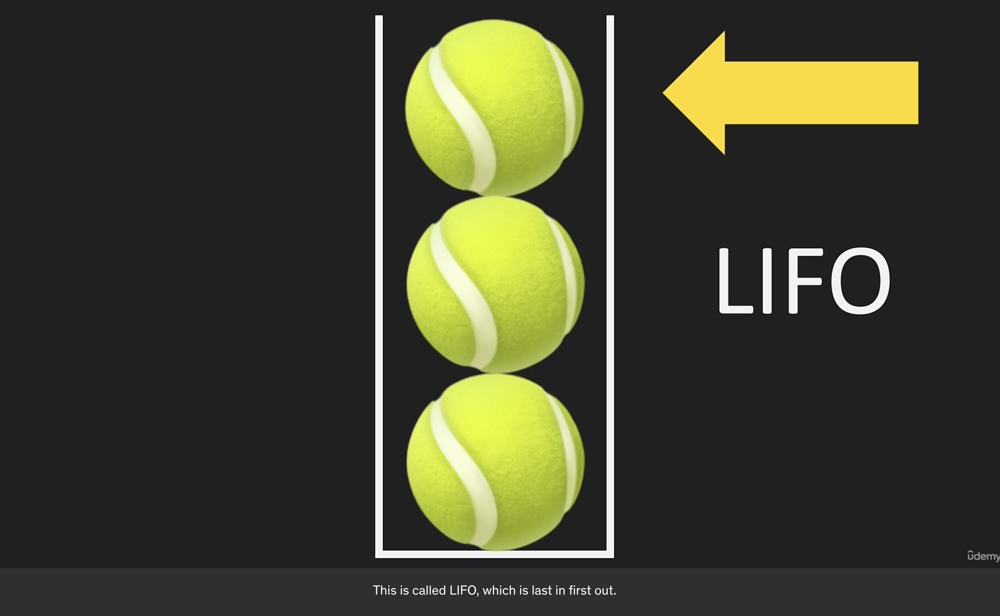
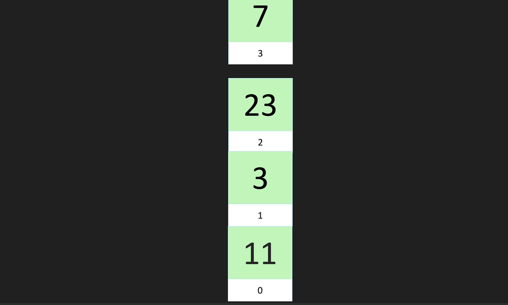
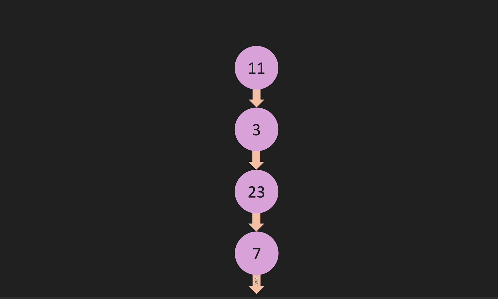
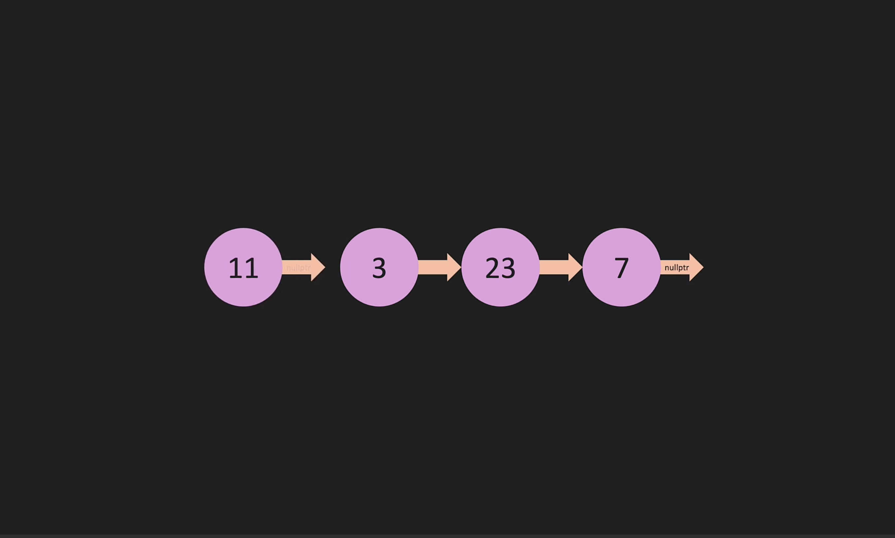
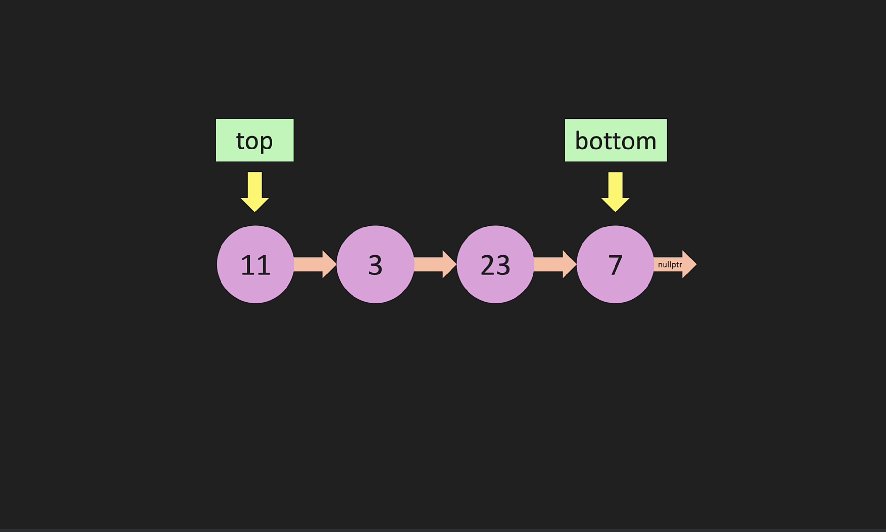
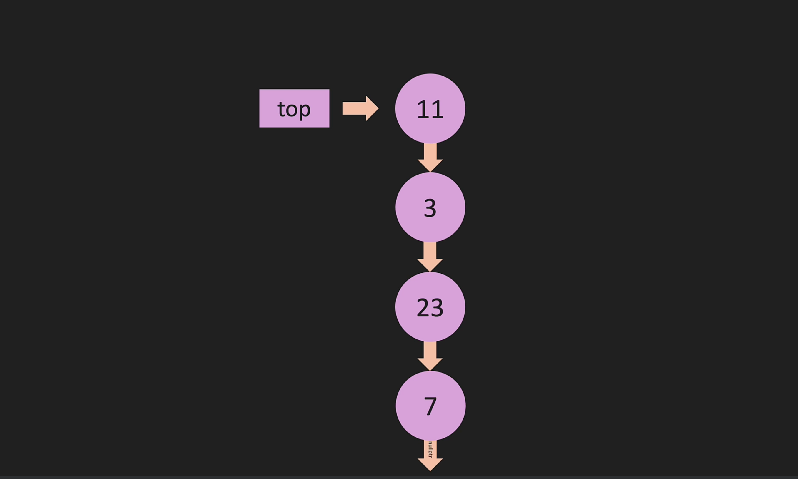
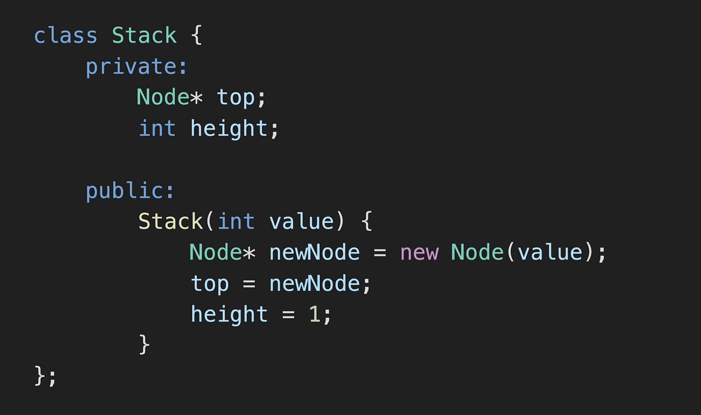
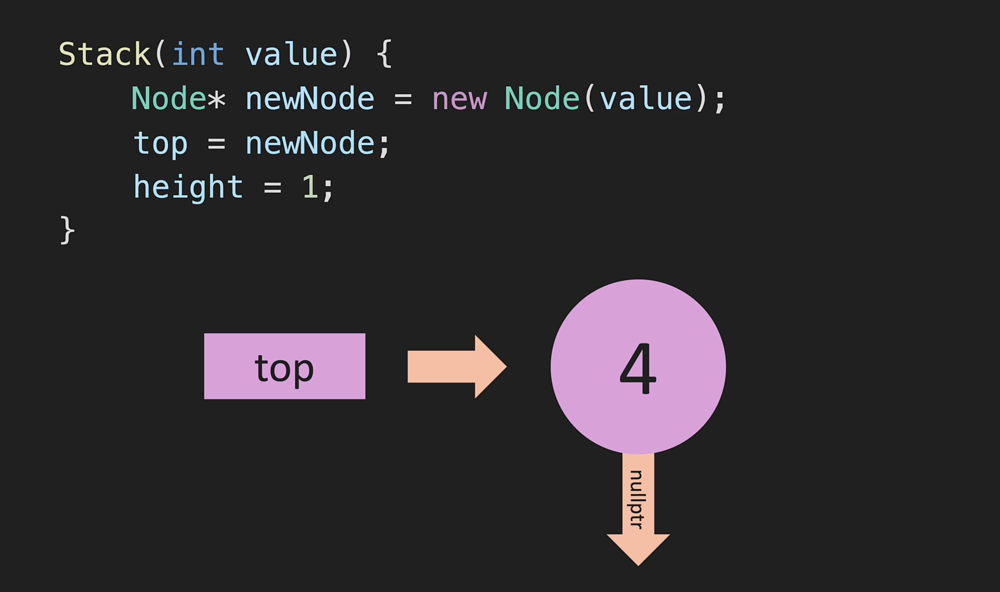

# Stack: [ LIFO ]
<b>Code:</b>

- [S_00-stack-structure.cpp]()

---
- We can only insert(push) or delete(pop) from the top part . Thats means it has only haed which is on the top.
- That means we can add or remove element at the **same end** means top.
  - so add or remove element is -> **O(1)** thats why we use stack not array.
  - But if we remove element from bottom which is not possible then it will re indexing event elements that why this time complexity is -> **O(n)**

<b>Complexity:</b>
- Top Element Add is **O(1)** 
- Top Element Remove is **O(1)** 
- Top Element View is **O(1)** 

<b>USE Case</b> 
- priviously visited web pages know as stack.
- **Expression evulation** e stck use hoi.
- (()) barcket sequence problem e use hoi.



### Push or Pop







<h4>Stack Constructor:</h4>


```json
A node is an un order map means which value is int and next is a pointer to a node.
{
    "value": 4,
    "next":nullptr
}
```
```cpp
// Create node class
class Node
{
public:
    int value; // 4
    Node *next; // nullptr

    Node(int val)
    {
        this->value = val;
        this->next = nullptr;
    }
};
```
`Stack looks like`


`Stack constructor looks like`

