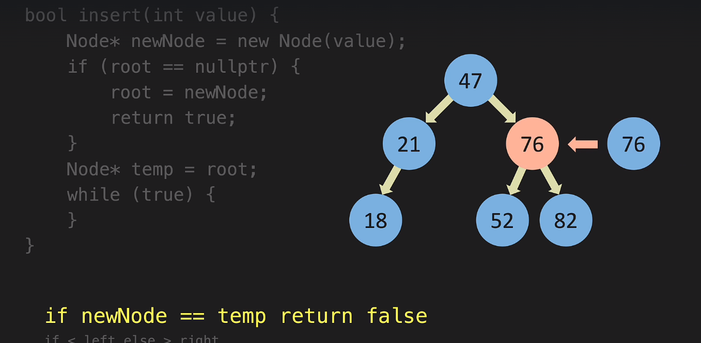

### Non Linear Data Structure [Binary Tree]

<b>🌱 Insert to BTS</b>
- `BTS--02-Insert.cpp`





<b> 🌱 Number Contain or not in BTS</b>

 


Node Class Creation:

```cpp
class node
{
public:
    int value; // int id
    node *left;
    node *right;
    node *parent; // temp for operation
};

class BinarySearchTree
{
    node *root;

    BinarySearchTree()
    {
        root = nullptr;
    }
    // crate new node function
    node *createNewNode(int value)
    {
        node *newNode = new node();
        newNode->value = value;
        newNode->left = nullptr;
        newNode->right = nullptr;
        newNode->parent = nullptr;
    };
};
int main()
{

    return 0;
}
```

Another way

```cpp
class node{
public:

    int data;
    node* left;
    node* right;

    node(int value){
        this->data=value;
        left=nullptr;
        right=nullptr;
    }
};


class BinarySearchTree{
public:


    node* root;
    BinarySearchTree(){
        
        root = nullptr;
    };

int main(){


    node* newNode = new node(value)
}


};
```

