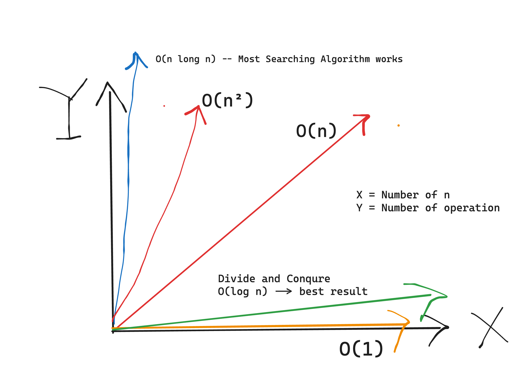

# 🅾️ 04-বিগ 

- **O(1) = Best = Constant value**

- **O(log n) = Best = Divide and Conquer method**

-  **O(n) = Proportional**

- **O(n²) = Loop within a Loop case**ও নোটেশন


- 
**বিগ ও নোটেশন** একটি গাণিতিক ধারণা যা অ্যালগরিদমের কার্যকারিতা বর্ণনা করতে ব্যবহৃত হয় **সময় জটিলতা** এবং **স্থান জটিলতা** এর দৃষ্টিকোণ থেকে। এই ধারণাগুলি বোঝা প্রযুক্তিগত সাক্ষাৎকারের জন্য এবং একজন ভাল প্রোগ্রামার হওয়ার জন্য অত্যন্ত গুরুত্বপূর্ণ।

## সময় জটিলতা

সময় জটিলতা পরিমাপ করে কিভাবে একটি অ্যালগরিদমের কার্যকরী সময় ইনপুট ডেটার আকার বাড়ানোর সাথে সাথে বাড়ে। প্রকৃত সময় পরিমাপ করার পরিবর্তে, যা যন্ত্রের গতি অনুযায়ী পরিবর্তিত হতে পারে, আমরা অ্যালগরিদম দ্বারা সম্পাদিত অপারেশনের সংখ্যা গণনা করি। এটি আমাদের কার্যকারিতার মূল্যায়ন করতে দেয় যন্ত্রপাতির পার্থক্য নির্বিশেষে। উদাহরণস্বরূপ, যদি আপনি দুটি কোড চালান, একটি 15 সেকেন্ডে সম্পন্ন হয় এবং অন্যটি বেশি সময় নেয়। তবে, আমরা প্রতিটি কোড কতগুলি অপারেশন সম্পাদন করে তা নিয়ে মনোযোগ দিই যাতে নির্ধারণ করা যায় কোনটি আরও কার্যকর।

### উদাহরণ

- **কোড এক:** 15 সেকেন্ডে চলে।
- **কোড দুই:** বেশি সময় নেয় কিন্তু কম অপারেশন ব্যবহার করে।

এই পরিস্থিতিতে, যদি কোড একের অপারেশনের সংখ্যা কম হয়, তবে এটি সময় জটিলতার দৃষ্টিকোণ থেকে আরও ভাল হিসাবে বিবেচিত হয়।

## স্থান জটিলতা

স্থান জটিলতা নির্দেশ করে একটি অ্যালগরিদম কতটা মেমরি ব্যবহার করে ইনপুটের আকারের ফাংশন হিসাবে। সময় জটিলতার মতোই, আমরা স্থান জটিলতাকে মূল্যায়ন করি যাতে বুঝতে পারি বড় ইনপুটগুলির সাথে মেমরির প্রয়োজনীয়তা কিভাবে বাড়ে। একটি অ্যালগরিদম দ্রুত হতে পারে কিন্তু অনেক মেমরি ব্যবহার করতে পারে, যখন অন্যটি ধীর হতে পারে কিন্তু আরও মেমরি-দক্ষ।

### উদাহরণ

- **কোড এক:** দ্রুত কার্যকরী কিন্তু উচ্চ মেমরি ব্যবহার।
- **কোড দুই:** ধীর কার্যকরী কিন্তু কম মেমরি ব্যবহার।

প্রয়োজনীয়তার উপর নির্ভর করে (গতি বনাম মেমরি), একটি কোড অন্যটির তুলনায় পছন্দ করা যেতে পারে।

## সাক্ষাৎকারে গুরুত্ব

প্রযুক্তিগত সাক্ষাৎকারগুলিতে, প্রার্থীকে প্রায়শই তাদের সমাধানগুলি উভয় সময় এবং স্থান জটিলতার জন্য অপ্টিমাইজ করার জন্য বলা হয়। সাক্ষাৎকার গ্রহণকারীরা একটি দৃশ্য উপস্থাপন করতে পারেন যেখানে একটি অ্যালগরিদম সময়ের জন্য অপ্টিমাইজ করা হয়েছে এবং তারপর তারা জিজ্ঞাসা করতে পারেন এটি কীভাবে স্থান দক্ষতার জন্য সমন্বয় করা যেতে পারে। উভয় ধারণা বোঝা ডেভেলপারদের আরও ভাল অ্যালগরিদম লেখার সুযোগ দেয় যা নির্দিষ্ট কর্মক্ষমতা মানদণ্ড পূরণ করে।

সংক্ষেপে, বিগ ও নোটেশন মাস্টার করা আমাদের অ্যালগরিদমগুলি কার্যকরভাবে বিশ্লেষণ করতে সাহায্য করে, অপ্টিমাইজেশন সম্পর্কে তথ্যপূর্ণ সিদ্ধান্ত নিতে সহায়তা করে এবং শেষ পর্যন্ত আরও কার্যকর কোড লেখতে সহায়তা করে।

# 🅾️ 05-বিগ ও নোটেশন এবং গ্রীক অক্ষর

যখন আপনি এই ধরনের নোটেশনের সাথে কাজ করছেন, তখন তিনটি গ্রীক অক্ষর আপনি নিয়মিত দেখবেন।
এগুলি হল:

- **ওমেগা (Ω),**
- **থেটা (Θ)** এবং
- **ওমিক্রন (Ο)।**

ওমিক্রন সাধারণত **Big O** হিসেবে পরিচিত, যেমন বিগ O, এবং বিগ O হল সেই অক্ষর যা আপনি সবচেয়ে বেশি দেখতে পাবেন।

## উদাহরণ

- [1,2,3,4,5,6,7]

এটি ব্যাখ্যা করতে, আমি একটি অ্যারে নিয়ে আসব।
ধরি আমরা একটি ফর লুপ তৈরি করছি যা এই অ্যারেটির মধ্য দিয়ে একটি নির্দিষ্ট সংখ্যা খুঁজে বের করার জন্য পুনরাবৃত্তি করবে।
যদি আমরা সংখ্যা ১ খুঁজছি, তাহলে এটি আমাদের সেরা কেস হবে যেখানে অ্যারেটির মধ্য দিয়ে সবচেয়ে কম পুনরাবৃত্তি হচ্ছে।

- **সেরা কেস:** সংখ্যা ১ পাওয়া -- (Ω)
- **গড় কেস:** সংখ্যা ৪ পাওয়া -- (Θ)
- **খারাপ কেস:** অন্য কোনো সংখ্যা পাওয়া -- O

এই সেরা কেসকে গ্রীক অক্ষর ওমেগা (Ω) দ্বারা উপস্থাপন করা হয়।
গড় কেসকে গ্রীক অক্ষর থেটা (Θ) দ্বারা উপস্থাপন করা হয়, এবং আমাদের খারাপ কেসকে ওমিক্রন বা O দ্বারা উপস্থাপন করা হয়।

## বিগ O এর গুরুত্ব

বিগ O সবসময় খারাপ কেসের জন্য ব্যবহৃত হয়।
এটি উল্লেখ করা গুরুত্বপূর্ণ কারণ অনেক সময় মানুষ বলে, "ঠিক আছে, এটা আপনার খারাপ কেস, বিগ O, কিন্তু আপনার সেরা বা গড় কেসের বিগ O কী?"

আসলেই, সেরা বা গড় কেসের জন্য বিগ O নেই।
সেগুলি হবে ওমেগা (Ω) বা থেটা (Θ)।

সুতরাং যখন আমরা বিগ O পরিমাপ করি, আমরা সর্বদা খারাপ কেস পরিমাপ করছি।

# 🅾️ 06-বিগ O নোটেশন: O(n)

এখন আমরা আমাদের প্রথম বিগ O নোটেশন দেখব।
আমি O(n) দিয়ে শুরু করছি, কারণ এটি সবচেয়ে কার্যকরী বা কম কার্যকরী নয়, বরং আমি মনে করি এটি বোঝার জন্য সবচেয়ে সহজ।

## উদাহরণ: logItems ফাংশন

O(n)

<!-- https://jsbin.com/fevopupili/edit?js,console -->

```javascript
function logItems(n) {
  for (let i = 0; i < n; i++) {
    console.log(i);
  }
}

logItems(10);
```

আমি একটি ফাংশন ব্যাখ্যা করব এবং এর নাম হবে `logItems`।
আমরা কিছু আইটেম কনসোল লগ করব।

আমরা একটি ফর লুপ চালাব।
ফর লুপটি N বার চলবে।
এরপর আমরা ফর লুপ থেকে I কনসোল লগ করব।
এবং এটাই O of N operation.

এটি একটি খুব সহজ কোড।

### Chrome Dev Tools এ পরীক্ষা

চলুন Chrome Dev Tools এ এটি দেখি।
এখানে আমাদের ফাংশন আছে।
আমরা এটি ১০ সংখ্যার সাথে কল করছি।
এখন চলুন এটি চালাই।

আপনি দেখতে পাবেন যে আমরা ০ থেকে ৯ পর্যন্ত কনসোল লগ করেছি।

### O(n) অপারেশন

এখন ফিরে আসি আমাদের অন্য স্ক্রীনে।
এটি একটি O(n) অপারেশন।

অন্যভাবে বললে, আমরা ফাংশনটিকে সংখ্যা n পাস করি এবং এটি n বার চলে।
যদি আমরা এটিকে ১০ পাস করি, তবে এটি ১০ বার চলে এবং ১০টি জিনিস আউটপুট করে।
এটাই O(n)।

## গ্রাফে O(n)

X = Number of n
Y = number of operations performed

x=y^2

চলুন এটি একটি গ্রাফে দেখি।
O(n) সবসময় একটি সোজা রেখা হবে।
এটি অনুপাতিক।
অপারেশনের সংখ্যা n এর সাথে অনুপাতিক হবে।

এই গ্রাফে, এই অক্ষটি n কে প্রতিনিধিত্ব করে এবং এই অক্ষটি অপারেশনের সংখ্যা প্রতিনিধিত্ব করে।

### সারসংক্ষেপ

এটি আমাদের প্রথম বিগ O নোটেশন।
আমরা এই গ্রাফে অন্যান্য বিগ O নোটেশন যোগ করব যাতে আমরা একটির বিরুদ্ধে অন্যটির তুলনা করতে পারি।
তবে আপাতত, এটি হল O(n)।

# 🅾️ 07-বিগ O নোটেশন: কনস্ট্যান্ট বাদ দেওয়া n + n => 2n == n

বিগ O নোটেশনের কিছু উপায় রয়েছে যার মাধ্যমে আমরা নোটেশনকে সহজ করি, এবং এটি বিষয়গুলোকে সহজ করে তোলে।
প্রথমটি যা আমরা দেখব সেটি হল কনস্ট্যান্ট বাদ দেওয়া।

## কনস্ট্যান্ট বাদ দেওয়া

এটি "কনস্ট্যান্ট মুছে ফেলা" হিসেবেও উল্লেখ করা হয়।
এখন আমি এই বিষয়টি ব্যাখ্যা করতে যাচ্ছি, এবং আমি গত ভিডিওতে O(n) এর কোড নিয়ে শুরু করব।
কিন্তু আমি একটি দ্বিতীয় ফর লুপ যোগ করব যা প্রথমটির মতোই হবে, তবে এখানে আমরা I এর পরিবর্তে J ব্যবহার করব।
এবং উভয় ফর লুপ n বার চলবে।

### DevTools এ পরীক্ষা

O(n)

<!-- https://jsbin.com/fevopupili/edit?js,console -->

চলুন এটি DevTools এ দেখি।
এখানে আমাদের কোড আছে এবং আমরা এটিকে ৩ সংখ্যার সাথে কল করছি।
এখন চলুন এটি চালাই।

আমাদের আউটপুট হল প্রথম ফর লুপ থেকে ০, ১, ২ এবং তারপর আবার দ্বিতীয় ফর লুপ থেকে ০, ১, ২।

```javascript
function logItems(n) {
  // O(n)
  for (let i = 0; i < 3; i++) {
    console.log(i);
  }
  // O(n)
  for (let j = 0; j < 3; i++) {
    console.log(j);
  }
}

logItems(10);
```

### O(2n) অপারেশন

এখন ফিরে আসি এখানে।
আমাদের কোড n + n বার চলেছে।
অথবা ২n।

তাহলে এটি বলা যুক্তিযুক্ত যে এটি একটি O(2n) অপারেশন, কিন্তু এখানেই সেই সহজীকরণের বিষয়টি আসে।

এটি গুরুত্বপূর্ণ নয় যে এটি ২n, ৩n, বা ১০০n; যদি সেখানে একটি কনস্ট্যান্ট থাকে তবে আমরা কনস্ট্যান্টটি বাদ দিই।
এবং আমরা বলি যে এই কোডটি O(n)।

## সারসংক্ষেপ

সুতরাং আমাদের বিগ O নোটেশন সহজ করার প্রথম নিয়ম হল কনস্ট্যান্ট বাদ দেওয়া।

# 🅾️ 08-বিগ O নোটেশন: O(n²)

যদি আমরা উপরের দিকে স্ক্রোল করি, তাহলে আমরা শুরু করি ০ থেকে।
এবং যদি আমরা নিচের দিকে স্ক্রোল করি, তাহলে আমরা পৌঁছাই ৯৯ এ।
সুতরাং, আমরা ১০০টি আইটেম আউটপুট করেছি।

## O(n²) অপারেশন

এখন ফিরে আসি এখানে।
এই ক্ষেত্রে আউটপুট হওয়া আইটেমের সংখ্যা হল n গুণ n।
অথবা n²।
এবং এখান থেকেই আমরা O(n²) পাই।

```js
function logItems(n) {
  for (let i = 0; i < n; i++) {
    for (let j = 0; j < n; j++) {}
  }
}

logItems(10);
```

### গ্রাফে O(n²)

চলুন এটি একটি গ্রাফে দেখি।
যদি আমাদের দুটি কোড সেট থাকে যা একই কাজ সম্পন্ন করে এবং একটি O(n²) এবং অন্যটি O(n) হয়, 
- তবে O(n) কোডটি ভাল কারণ এটি কম অপারেশনের মধ্যে কাজটি সম্পন্ন করবে।

এটি আমাদের প্রথম সুযোগ যে কিভাবে আমরা একটি কোড সেটকে অন্যটির সাথে তুলনা করতে পারি।

O(n²) সাধারণত একটি কার্যকরী কোড হিসেবে বিবেচিত হয়।
যদি আপনি আপনার কোডটি এমনভাবে লিখতে পারেন যা O(n) হবে, তবে এটি অনেক বেশি কার্যকরী হবে।

## সারসংক্ষেপ

সুতরাং, এটি হল O(n²)।

# 🅾️ 09-বিগ O নোটেশন: অ-প্রভাবশালী টার্ম বাদ দেওয়া O(n²) + O(n) = O(n²+ n) = O(n²)

৯৯। 
এটি আমাদের নেস্টেড ফর লুপ, দ্বিতীয় ফর লুপটি ০ থেকে ৯ পর্যন্ত চলে। 

## O(n²) এবং O(n)

এখন চলুন এটি এখানে দেখি। 
সেই নেস্টেড ফর লুপটি O(n²) বার চলেছে। 
দ্বিতীয়টি O(n) বার চলেছে। 
যখন আমরা এগুলো একত্রিত করি, এটি হয়ে যায় O(n² + n)।


```js
function logItems(n) {

    // O(n²)
  for (let i = 0; i < n; i++) {
    for (let j = 0; j < n; j++) {}
  }
    // O(n)
for (let i = 0; i < n; i++) {
   
  }
}

logItems(10);
```

### উদাহরণ: n = 100

যদি আপনি এটি ভাবেন যখন n হল ১০০, তখন n² হবে ১০,০০০, যেখানে এই সমীকরণে যোগ করা একক n কেবল ১০০ বেশি। 
এটি আসলে অপারেশনের সংখ্যা প্রভাবিত করছে না। 

- n² হল প্রধান টার্ম এবং n একা অপ্রধান টার্ম। 
- O(n²) + O(n) = O(n²+ n) = O(n²)
সুতরাং আমরা এটিকে বাদ দিই।

## সারসংক্ষেপ

সুতরাং, আমাদের দ্বিতীয় নিয়ম হল অপ্রধান টার্ম বাদ দেওয়া।


# 🅾️ 10- বিগ O নোটেশন: O(1)

এখন, যদি আমরা একটি নতুন যোগফল যোগ করি। 
তাহলে এখন এটি দুটি অপারেশন, তাই এটি O(2)। 
এবং আপনি হয়তো অনুমান করেছেন, আমরা এটি সহজীকরণ করব এবং O(1) বানাব।


```js
function add(n) {
    return n+n+...
}

add(10);
```

## O(1) বা কনস্ট্যান্ট টাইম

O(1) অনেক সময় কনস্ট্যান্ট টাইম হিসেবেও উল্লেখ করা হয়। 
এই পরিস্থিতিতে যেখানে আমাদের দুটি যোগফল রয়েছে, এটি দুটি অপারেশন। 
এটি কনস্ট্যান্ট, যেকোনো N এর জন্য। 
অপারেশনের সংখ্যা n পরিবর্তিত হলে পরিবর্তিত হয় না।

### গ্রাফে O(1)

চলুন এটি একটি গ্রাফে দেখি। 
এটি নিচের দিকে একটি সোজা রেখা। 
এটি সবচেয়ে কার্যকরী বিগ O। 
কোন কিছুই O(1) এর চেয়ে বেশি কার্যকরী নয়।

মনে রাখবেন, আপনি এটি কনস্ট্যান্ট টাইম হিসেবেও শুনতে পাবেন। 
সুতরাং যদি আপনি সেই শব্দটি শোনেন, তাহলে এটি O(1)।


# 🅾️ 11- বিগ O নোটেশন: O(log n)

আমরা এটি মুছে ফেলব এবং আবার করব। 
এখন আমরা সংখ্যা এক খুঁজে পেয়েছি। 
এটি একটি কৌশল যা **"Divide and Conqure"** নামে পরিচিত। 

## পদক্ষেপ গোনা

এখন আমরা এখানে সবকিছু ফিরিয়ে আনব এবং সেই আইটেমটি খুঁজে বের করতে যে পদক্ষেপগুলি আমরা নিয়েছি তা গুনবো। 
এটি ছিল এক, দুই, তিন। 
মনে রাখবেন আমাদের অ্যারেতে আটটি আইটেম ছিল। 
এবং ২ এর তৃতীয় শক্তি ৮ সমান।

### লগারিদমে রূপান্তর

আমি এটি একটি লগারিদমে পরিণত করব। 
এবং যদি আপনি গণিতের মানুষ না হন, চিন্তা করবেন না। 
আমরা এতে গভীরভাবে যাব না। 

কিন্তু এখানে আমাদের তিনটি সংখ্যা আছে: ২, ৩ এবং ৮। 
log₂(৮) = ৩।

আমি এটি পিছনে নিয়ে যাব এবং আবার দেখব। 
log₂(৮) = ৩। 
আমরা মূলত বলছি ২ এর কোন শক্তি ৮ সমান? 

২ এর কোন শক্তি ৮ সমান? 
ঠিক আছে, সেই সংখ্যা হল ৩।

### পুনরাবৃত্তি কাটা

অন্যভাবে বললে, যদি আমরা সংখ্যা ৮ কে বারবার অর্ধেক করি, তাহলে আমরা কতবার এটি দুই দ্বারা ভাগ করব যাতে একটিতে পৌঁছাতে পারি? 
এটি তিনবার হবে।

### বৃহৎ সংখ্যার ক্ষেত্রে

এখন যখন আমরা খুব বড় সংখ্যায় পৌঁছাই, ধরুন আমাদের log₂(এই সংখ্যা) আছে এবং এটি এক বিলিয়নের বেশি। 
আপনি কতবার এই সংখ্যাটি অর্ধেক করবেন যাতে একটিতে পৌঁছাতে পারেন? 
এটি হবে ৩১ বার।

অন্যভাবে বললে, ২ এর ৩১ তম শক্তি এই সংখ্যার সমান যা এক বিলিয়নের বেশি।

### উদাহরণ: বিলিয়ন আইটেমের অ্যারে

সুতরাং, যদি আপনার কাছে এক বিলিয়ন আইটেমের একটি অ্যারে থাকে এবং আপনি কিছু খুঁজতে চান এবং ধরুন আপনি যা খুঁজছেন তা হল শেষ আইটেম, তবে আপনাকে এটি খুঁজে বের করার জন্য এক বিলিয়ন আইটেম দেখতে হবে।

কিন্তু যদি আপনি ডিভাইড অ্যান্ড কনকার ব্যবহার করেন, তবে আপনি সেই অ্যারেতে যে কোনও আইটেম ৩১ পদক্ষেপে খুঁজে পেতে পারেন। 
এবং এটি হল O(log n) এর শক্তি।

## গ্রাফে O(log n)

এখন চলুন এটি একটি গ্রাফে দেখি। 
এটি খুব সমতল। 
অবশ্যই O(1) এর মতো সমতল নয়, কিন্তু O(n) এবং O(n²) এর তুলনায় খুব কার্যকরী।

### O(n log n)

এই পয়েন্টে আমি গ্রাফে আরেকটি বিষয় দেখাতে চাই। 
আমি এতে অনেক বিস্তারিত আলোচনা করতে যাচ্ছি না, তবে আমি শুধু এটি দেখাতে চাই, যা হল O(n log n), যা কিছু সাজানোর অ্যালগরিদমে ব্যবহৃত হয়।

এটি সবচেয়ে কার্যকরী যা আপনি একটি সাজানোর অ্যালগরিদম তৈরি করতে পারেন যদি আপনি শুধুমাত্র সংখ্যা সাজাচ্ছেন না। 
কিন্তু যদি আপনি একাধিক ধরনের ডেটা সাজাতে চান, যেমন স্ট্রিংস, তাহলে এটি হল সাজানোর অ্যালগরিদমের জন্য সবচেয়ে কার্যকরী।

আমরা এই বিষয়টি আলোচনা করব এবং কীভাবে আমরা n log n এ পৌঁছেছি যখন আমরা সেই সাজানোর অ্যালগরিদমগুলিতে পৌঁছাব, কারণ তখন এটি আরও অর্থপূর্ণ হবে। 

সুতরাং এখন আমি এটি আলোচনা করতে যাচ্ছি না। 

## সারসংক্ষেপ

সুতরাং কোর্সের বাকি অংশের জন্য, আমরা যা কিছু দেখব তা এই চারটির মধ্যে একটি হবে।
সুতরাং, এটি হল O(log n)।


# 🅾️ 12- বিগ O নোটেশন: অ্যারেগুলির জন্য

এখন আমরা অ্যারেগুলির বিগ O সম্পর্কে কথা বলব। 
এটি বোঝা গুরুত্বপূর্ণ যাতে আমরা অন্যান্য ডেটা স্ট্রাকচারের সাথে অ্যারেগুলির তুলনা করতে পারি।

## অ্যারে তৈরি করা

আমি একটি অ্যারে দিয়ে শুরু করব, কিন্তু আমি এটি এমনভাবে উপস্থাপন করব। 
আমরা এখানে ইনডেক্সগুলি রেখেছি কারণ এটি অ্যারেগুলির বিগ O ব্যাখ্যা করতে গুরুত্বপূর্ণ হবে।

আমরা একটি অ্যারে শুরু করব যা আমরা ইতিমধ্যে তৈরি করেছি, এবং এটি "my array" নামে পরিচিত। 
এরপর আমরা একটি আইটেম শেষের দিকে যোগ করব। 
সুতরাং `myArray.push(17)` এই সংখ্যা ১৭ কে ইনডেক্স ৪ এ যোগ করবে।

### পুশ এবং পপ অপারেশন

এখানে গুরুত্বপূর্ণ বিষয় হল, আমাদের এই বা এই বা এই সমস্ত কিছু আবার ইনডেক্স করতে হবে না। 
একইভাবে, যখন আমরা একটি আইটেম পপ করি এবং এটি সরিয়ে ফেলি, তখন আমাদের কিছু ইনডেক্স করতে হবে না। 
এবং এর জন্য, পুশ এবং পপ উভয়ই O(1) অপারেশন।

## শিফট এবং আনশিফট অপারেশন

কিন্তু অ্যারের অন্য প্রান্তে এটি ভিন্ন। 
চলুন `myArray.shift()` ব্যবহার করে প্রথম আইটেমটি সরিয়ে ফেলি। 
সমস্যা হল যে এই ইনডেক্সটি ভুল। 
অ্যারেতে প্রথম আইটেমটি শূন্য হওয়া উচিত। 
সুতরাং এটি শূন্যে পুনরায় ইনডেক্স করতে হবে। 
এবং পরবর্তী আইটেমটিকেও পুনরায় ইনডেক্স করতে হবে।

একইভাবে, যদি আমরা `unshift` করি এবং ১১ টি ফিরিয়ে আনি, তবে আমাদের পুরো অ্যারেটি পুনরায় ইনডেক্স করতে হবে শুধুমাত্র এটিকে ফিরিয়ে আনতে।

এটি ছোট একটি অ্যারে হলে বড় সমস্যা নয়, তবে যদি আমাদের হাজার হাজার আইটেমের একটি অ্যারে থাকে, তবে এটি অনেক পুনরায় ইনডেক্সিং। so , **O(n)**

### O(n) অপারেশন

সুতরাং এটি O(n), যেখানে n হল অ্যারে-এ আইটেমের সংখ্যা। 
অ্যারেগুলির সাথে বোঝা খুবই গুরুত্বপূর্ণ যে এই প্রান্তে যোগ এবং সরানো উভয়ই O(1)। 
অন্য প্রান্তে, পুনরায় ইনডেক্সিংয়ের কারণে সরানো এবং ফিরিয়ে আনা উভয়ই O(n)।

## মধ্যবর্তী ইনডেক্সে আইটেম যোগ করা

এখন চলুন দেখি কিভাবে আমরা এই অ্যারের মধ্যবর্তী অংশে কিছু যোগ করি। 
আমরা বলব `myArray.splice(1, 0, "hi")`। 
যদি আপনি এটি আগে না দেখে থাকেন, তাহলে আমরা বলছি যে আমরা ইনডেক্স ১ এ কিছু রাখব। 

এই শূন্য মানে হল যে আমরা কোন আইটেম মুছে ফেলছি না এবং এটি মানে যে আমরা "hi" স্ট্রিং যুক্ত করছি।

### পুনরায় ইনডেক্সিং

যখন আমরা ইনডেক্স ১ এ নতুন আইটেমটি রাখি, তখন এই ইনডেক্সটি ভুল হয়ে যায়। 
আমাদের এটি পুনরায় ইনডেক্স করতে হবে এবং এর পরবর্তী সবকিছু পুনরায় ইনডেক্স করতে হবে। 

যেহেতু আমাদের সবকিছু পুনরায় ইনডেক্স করতে হচ্ছে, তাই এটি O(n) হবে। আপনি হয়তো বলবেন, "হে, আমরা তো মধ্যবর্তী অংশে সেটি রাখছি, তাহলে কি এটা O(1/2n) নয়?" 

## বিগ O এর নিয়ম

এখানে দুটি সমস্যা রয়েছে:
1. বিগ O সর্বদা খারাপ কেস পরিমাপ করে, গড় কেস নয়।
2. যদি এটি ১/২n অপারেশনও হয়, তবে ১/২ একটি কনস্ট্যান্ট এবং আমরা কনস্ট্যান্টগুলি বাদ দিই।

তাহলে যাই হোক না কেন, এটি O(n)।

একইভাবে যখন আমরা এই আইটেমটি মুছে ফেলতে যাব তখন আমাদের সবকিছু পুনরায় ইনডেক্স করতে হবে। 
সুতরাং এটি গুরুত্বপূর্ণ নয় যে আপনি অ্যারের মাঝখানে কিছু যোগ বা সরাচ্ছেন; এটি সবসময় O(n) হবে।

## আইটেম খোঁজা

এখন চলুন দেখি কিভাবে একটি আইটেম খুঁজতে হয়। ধরুন আমরা এই অ্যারেতে সংখ্যা ৭ খুঁজছি। 
এর জন্য আমাদের শুরু থেকে দেখতে হবে: "এটা কি ৭?" না। না। 
এবং অবশেষে আমরা ৭ এ পৌঁছালে "হ্যাঁ"।

### খোঁজার জটিলতা

এটি মানে হল যে যদি আপনি মান দ্বারা অনুসন্ধান করেন, তবে এটি O(n)।
কিন্তু যদি আপনি ইনডেক্স দ্বারা অনুসন্ধান করেন এবং বলেন, "আমাকে বলুন ইনডেক্স ৩ এ কি আছে?" তাহলে সেই ইনডেক্সগুলি আপনাকে সরাসরি সেই স্থানে যেতে দেয় যা O(1) অপারেশন।

এটি অ্যারের একটি বড় সুবিধা হল যে আমরা এক মিলিয়ন আইটেমের একটি অ্যারেতে কিছু খুঁজে বের করতে পারি এবং say ৪০০,০০০ তম আইটেমে যেতে পারি এবং এটি O(1)।

### ডেটা স্ট্রাকচারের সুবিধা ও অসুবিধা

কিন্তু এই ইনডেক্সগুলি অ্যারের জন্য অসুবিধাও সৃষ্টি করে।
যদি আপনি শুরুতে কিছু যোগ করেন যেমন আমরা দেখেছি, কারণ আপনাকে সবকিছু পুনরায় ইনডেক্স করতে হবে।

### সিদ্ধান্ত নেওয়া

সুতরাং যখন আপনি একটি ডেটা স্ট্রাকচার দেখছেন তখন আপনাকে দেখতে হবে আপনি এটি কী জন্য ব্যবহার করছেন। 
যদি আপনাকে জিনিসগুলি ইনডেক্স দ্বারা প্রবেশ করতে হয় তবে অ্যারে একটি দুর্দান্ত ডেটা স্ট্রাকচার; কিন্তু যদি আপনি শুরু থেকে অনেক আইটেম যোগ ও সরান তবে সম্ভবত এটি আপনার জন্য সেরা ডেটা স্ট্রাকচার নয়।

এবং যদি আপনার ব্যবহার কেস হয় তবে আপনাকে একটি ভিন্ন ডেটা স্ট্রাকচারের দিকে নজর দিতে হতে পারে। 

কিন্তু যাই হোক না কেন, আপনি বিগ-O এর ভিত্তিতে আপনার সিদ্ধান্ত নিচ্ছেন।